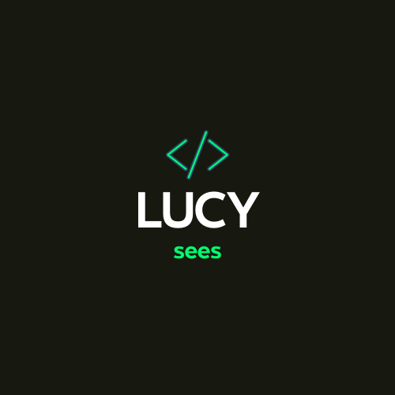

  
   

<h3><b>To Do list</b></h3>

# 📗 Table of Contents

- [📖 About the Project](#about-project)
  - [🛠 Built With](#built-with)
    - [Tech Stack](#tech-stack)
    - [Key Features](#key-features)
  - [🚀 Live Demo](#live-demo)
- [💻 Getting Started](#getting-started)
  - [Setup](#setup)
  - [Prerequisites](#prerequisites)
  - [Deployment](#deployment)
- [👥 Authors](#authors)
- [🤝 Contributing](#contributing)
- [⭐️ Show your support](#support)
- [🙏 Acknowledgements](#acknowledgements)
- [❓ FAQ (OPTIONAL)](#faq)
- [📝 License](#license)

# 📖 To Do list 

**To Do list** In this project, I build a simple HTML list of To Do tasks. This simple web page will be built using webpack and served by a webpack dev server.

## 🛠 Built With 

### Tech Stack 

  
Client

  <ul>
    <li>HTML</li>
    <li>JavaScript</li>
    <li>CSS</li>
    <li>Bootstrap</li>
    </ul>

(<a href="#readme-top">back to top</a>)

### Key Features 

- List Section - Displays the list of activities/tasks added via the form section.

- Add Button - Adds activities/tasks to the list.

- Clear Button - Clears the completed activities/tasks from the list.

(<a href="#readme-top">back to top</a>)

## 🚀 Live Demo 

- [To Do List Live Demo](https://lucy-sees.github.io/CheckLister/dist/)

(<a href="#readme-top">back to top</a>)

## 💻 Getting Started 

To get a local copy up and running, follow these steps.

### Prerequisites

In order to run this project you need:
Install Git Bash, Web browser and code editor

### Setup

Clone this repository to your desired folder:
cd my-folder
git clone git@github.com:myaccount/https://github.com/lucy-sees/To-Do-List.git

### Deployment

You can deploy this project using:
Web Browser

(<a href="#readme-top">back to top</a>)

## 👥 Authors 

👤 **Lucy W. Mwangi**

- GitHub: [@lucy-sees](https://github.com/lucy-sees)
- Twitter: [@\_The_LoneWolf](https://twitter.com/_The_LoneWolf)
- LinkedIn: [LinkedIn](https://www.linkedin.com/in/lucy-w-mwangi-83a31b11b/)

(<a href="#readme-top">back to top</a>)

## 🔭 Future Features 

- **Add different sections for different kinds of tasks**
- **Add time and date**

(<a href="#readme-top">back to top</a>)

## 🤝 Contributing 

Contributions, issues, and feature requests are welcome!

Feel free to check the [issues page](../../issues/).

(<a href="#readme-top">back to top</a>)

## ⭐️ Show your support 

If you like this project give it a star!!!

(<a href="#readme-top">back to top</a>)

## 📝 License 

This project is [MIT](https://github.com/lucy-sees/To-Do-List/blob/c0a8160bc7aa6d0d9fe80aa269ce5cd7b5f72b8c/LICENSE) licensed.

(<a href="#readme-top">back to top</a>)

